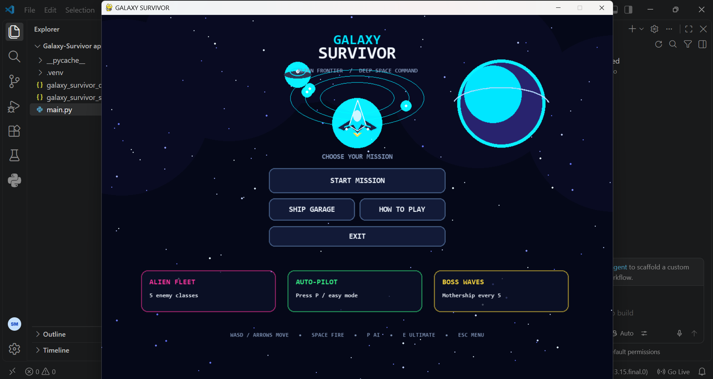
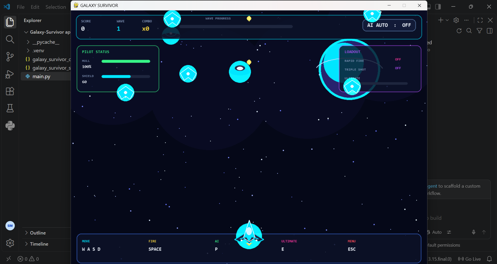
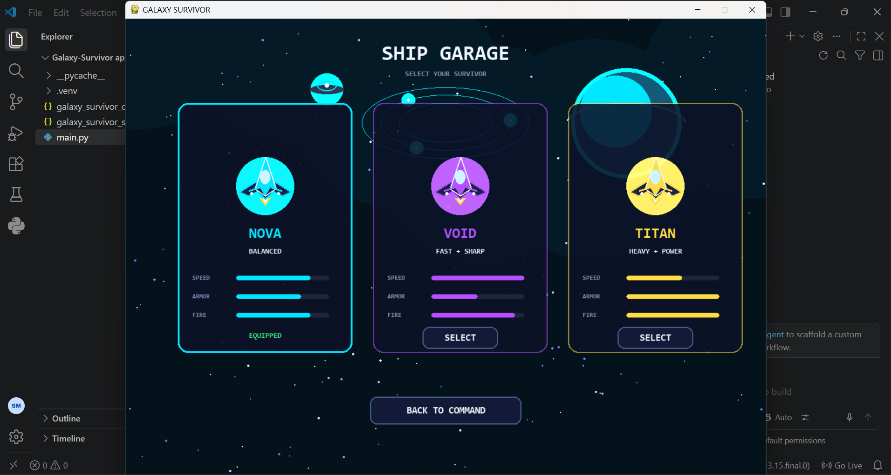
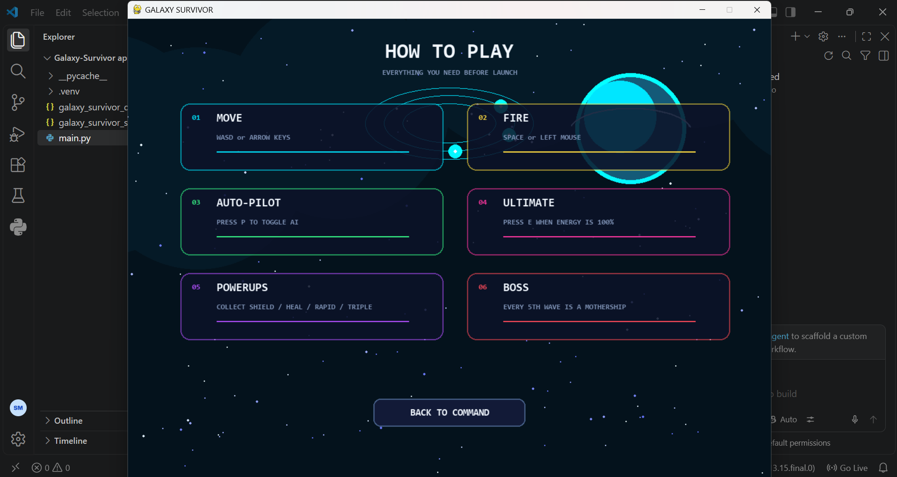

# 🚀 GALAXY SURVIVOR

### 🌌 A Futuristic Alien Space Survival Game

Galaxy Survivor is a 2D space survival game developed using **Python and Pygame**.

Fight aliens, destroy UFOs, collect power-ups and survive through different waves!

---

## 🎮 Game Preview

### 🏠 Home Screen



### 🚀 Gameplay



### 🛸 Ship Garage



### 📖 Tutorial



---

## ✨ Features

- 🚀 Futuristic spaceship
- 👽 Multiple alien enemies
- 🛸 UFO enemies
- 🌌 Animated galaxy backgrounds
- 💥 Shooting and particle effects
- ⚡ Power-ups
- ❤️ Health system
- 🛡️ Shield system
- 🔥 Combo scoring
- 🤖 AI Auto-Pilot
- 🪙 Coins and rewards
- 🛸 Ship Garage
- 🎵 Game sound effects
- 🌠 Animated stars
- 📈 Increasing difficulty
- 🎮 Easy controls

---

## 👽 Enemy Types

| Enemy | Description |
|---|---|
| Drone | Basic enemy |
| Scout | Fast enemy |
| Hunter | Follows the player |
| Tank | Strong enemy |
| Elite | Powerful enemy |
| UFO | Special flying enemy |

---

## 🤖 AI Auto-Pilot

Galaxy Survivor includes an **AI Auto-Pilot mode**.

When AI is enabled, the spaceship automatically moves toward enemies and fires.

### AI Control

```text
P = Toggle AI ON / OFF